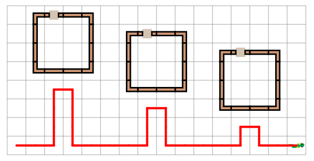

# SSSsnake
IPythonDisplayTurtle with addded functionality for our schools python classes.

How to install from a terminal/command prompt:
	pip install SSSsnake
	
To install from a jupyter notebook cell:
	!pip install SSSsnake

How to use:
```python
# Code adapted from one of the exercises made for my school

from SSSsnake import SSSsnake 
### VVV this segment can be hidden from students!
snake = SSSsnake(homeX = 5+25/2, homeY = 5+25/2 + 25*7) 
def houseAtXY(x,y):
    return [[x-1,y,3],[x+1,y,1],[x+2,y,4],[x+2,y+1,0],[x+2,y+2,0],[x+2,y+3,5],[x+1,y+3,1],[x,y+3,1],[x-1,y+3,2],[x-1,y+2,0],[x-1,y+1,0]]
walls = [];doors = [];walls.extend(houseAtXY(2,0));doors.append([2,0,1]);walls.extend(houseAtXY(7,1));doors.append([7,1,1]);walls.extend(houseAtXY(12,2));doors.append([12,2,1])
snake.drawLevel(xSize=16, ySize=8, gridSize=25, walls=walls, doors=doors)
snake.speed(10)

snake.pendown() # the snake can do more than you think! It can Draw!

# --------------------- vv Work zone vv --------------------- 

def smartmove(amount):
    for i in range(amount):
        snake.forward()

# TODO: define a function, Hint: you can use the smart move from before here as well!
# Also this snake knows how to turn left :)
### you would leave the function empty for the students to fill!
def drawncolumn(height):
    snake.left()
    smartmove(height)
    snake.right()
    snake.forward()
    snake.right()
    smartmove(height)
    snake.left()
    
    
# TODO: draw 3 collumns of length 3, 2, and 1, under the houses! 
    
smartmove(2)
drawncolumn(3)  
smartmove(4)
drawncolumn(2)  
smartmove(4)
drawncolumn(1) 
smartmove(2)


# --------------------- ^^ Work zone ^^ ---------------------

snake.display()
```



[](https://mybinder.org/v2/gh/atahan-git/SSSsnake/master)